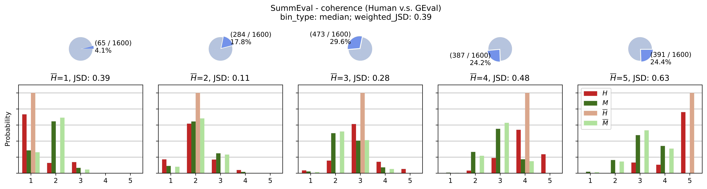
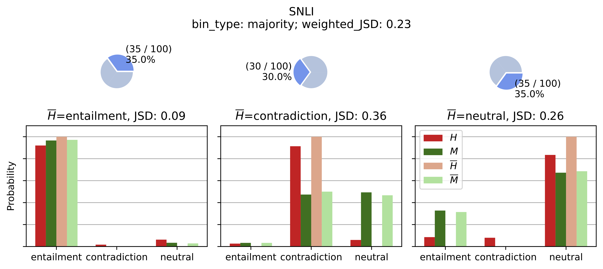

## BeyondCorrelation: The impact of human uncertainty in measuring the effectiveness of automatic evaluation and LLM-as-a-judge

This is the implementation of our ArXiv preprint:

[BeyondCorrelation: The impact of human uncertainty in measuring the effectiveness of automatic evaluation and LLM-as-a-judge](https://arxiv.org/pdf/2410.03775)

Authors: 
[Aparna Elangovan](https://scholar.google.com/citations?user=eaow7uAAAAAJ&hl=en)
[Lei Xu](https://leixx.io/), 
[Jongwoo Ko](https://sites.google.com/view/jongwooko),
[Mahsa Elyasi](https://mahsae.github.io/),
[Ling Liu](https://www.amazon.science/author/ling-liu),
[Sravan Bodapati](https://scholar.google.com/citations?user=UjxTzEsAAAAJ&hl=en),
[Dan Roth](https://www.cis.upenn.edu/~danroth/)


*Welcome to the repository for our paper, which takes a deeper look at how well automatic evaluation methods (like LLM-as-a-Judge) align with human evaluations. If you're using automatic metrics to evaluate generative models, this project is for you!*

## 📋 What is the problem?
Automatic evaluation methods, such as LLM-as-a-Judge methods, are often validated by comparing them to human evaluations using correlation scores. However, there's no consensus on which correlation metric to use. 

This package offers a comprehensive suite to compute various correlation metrics, to help you diagnose issues with the automatic evaluation. 

## 🔍 Key Insights from Our Work
We uncover two critical observations about the relationship between human and machine evaluations:

1. When human labels are inconsistent or uncertain (e.g., opinions or preferences), machines can appear to correlate better with the majority human label than humans themselves!
2. This gives a false impression that automatic evaluations are as good as or better than human agreement.
When human labels are consistent, the machine-human correlation drops significantly below human-to-human (HH) agreement.

## 🚀 Getting Started

### GEval Example
We recommend you to try GEval example first:

```base
PYTHONPATH=. python3 examples/geval_example.py 
```

The script will download [SummEval](https://github.com/Yale-LILY/SummEval) dataset and [GEval](https://github.com/nlpyang/geval) results, then compute the correlation between machine labels and human labels. 

Running the script, you will get the visualization of human labels and machine labels binned by human label median. And the Jason Shannon distance introduced in our paper will also be visualized in the figure. 


Besides visualization, the script will also compute various correlation metrics, on data subsets that selected by the human label uncertainty. 

| name                                            | proportion | size | H_median_dispersion | M_median_dispersion | krippendorff_HH | krippendorff_MM | krippendorff_H-median_M-median | ... |
|-------------------------------------------------|------------|------|---------------------|---------------------|-----------------|-----------------|--------------------------------|-----|
| All                                             | 100.0      | 1600 | 4                   | 3                   | 0.55            | 0.74            | 0.31                           |     |
| human_labels_num_unique = 1 (perfect agreement) | 12.5       | 200  | 4                   | 3                   | 1.00            | 0.78            | 0.25                           |     |
| human_labels_num_unique = 2                     | 66.2       | 1059 | 4                   | 3                   | 0.53            | 0.75            | 0.30                           |     |
| human_labels_num_unique = 3                     | 21.3       | 341  | 2                   | 3                   | 0.19            | 0.70            | 0.32                           |     |
| ...                                             |            |      |                     |                     |                 |                 |                                |     |


### More Examples
For other examples, you will first setup AWS Bedrock access, in order to generate machine labels using LLMs. 

You can produce results for datasets on [JudgeBench](https://github.com/dmg-illc/JUDGE-BENCH) using the following command.

```bash
PYTHONPATH=. python3 examples/judge_bench_example.py \
	--exp_dir judge_bench_topical_chat_experiment \
	--dataset_name topical_chat \
	--dataset_path judge_bench_topical_chat_experiment/data/topical_chat_short.json \
	--llm llama_3_70B
```

The following command would produce results for [SNLI](https://nlp.stanford.edu/projects/snli/) dataset.

```bash
PYTHONPATH=. python3 examples/snli_example.py \
	--exp_dir snli_experiment \
	--dataset_path snli_experiment/data/snli_1.0_dev.jsonl \
	--llm llama_3_70B
```


## Apply it on your own data
Please follow the [Notebook of Toy Example](examples/toy_example.ipynb).


## Citation
If you use our tools in your project, please cite our work:
```
@misc{elangovan2024correlationimpacthumanuncertainty,
      title={Beyond correlation: The impact of human uncertainty in measuring the effectiveness of automatic evaluation and LLM-as-a-judge}, 
      author={Aparna Elangovan and Jongwoo Ko and Lei Xu and Mahsa Elyasi and Ling Liu and Sravan Bodapati and Dan Roth},
      year={2024},
      eprint={2410.03775},
      archivePrefix={arXiv},
      primaryClass={cs.HC},
      url={https://arxiv.org/abs/2410.03775}, 
}
```

## Security

See [CONTRIBUTING](CONTRIBUTING.md#security-issue-notifications) for more information.

## License

This project is licensed under the Apache-2.0 License.

